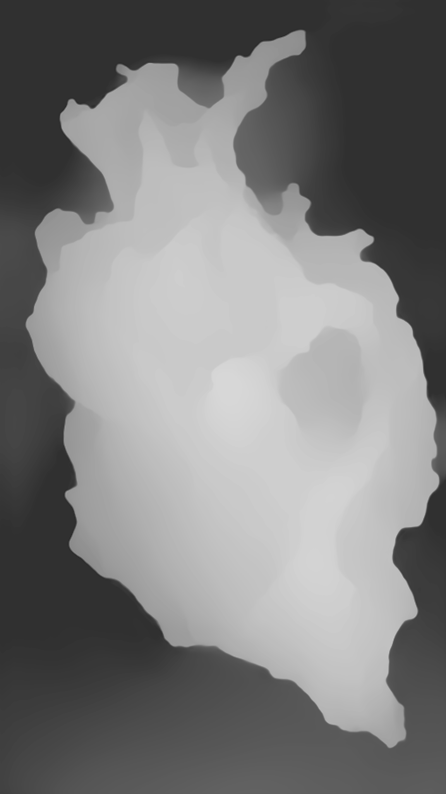
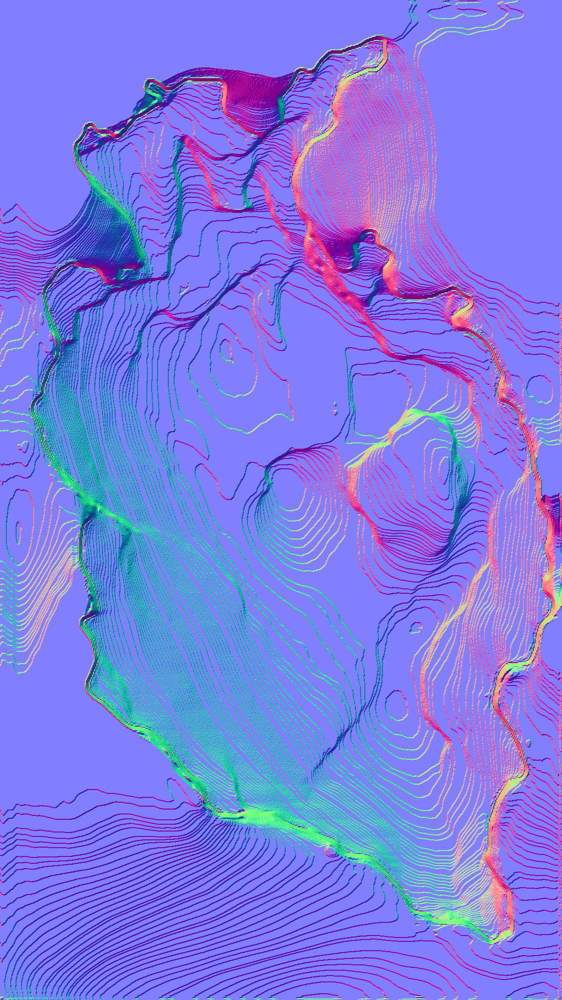

# disparity-view
viewer for disparity data in npy file format

## checked environment
- NVIDIA Jetson AGX orin
- Ubuntu 20
- python3.8
- Optional:
  - ZED SDK 4.1 (StereoLabs)

## Install in docker environment
pip install is executed in Dockerfile.
```commandline
docker_build.sh
docker_run.sh

# now you can  execute inside docker environment
zed_capture -h
disparity_viewer -h
```

## Install without docker
```commandline
python3 -m pip install .[dev]
```

## tools

```
$ disparity_viewer -h
usage: disparity_viewer [-h] [--sec SEC] [--vmax VMAX] [--vmin VMIN] [--disp3d] [--save] [--gray] [--jet] [--inferno] captured_dir

disparity npy file viewer

positional arguments:
  captured_dir  captured directory by capture.py

optional arguments:
  -h, --help    show this help message and exit
  --sec SEC     wait sec
  --vmax VMAX   max disparity [pixel]
  --vmin VMIN   min disparity [pixel]
  --disp3d      display 3D
  --save        save colored or ply

colormap:
  --gray        gray colormap
  --jet         jet colormap
  --inferno     inferno colormap


$ view_npy -h
usage: view_npy [-h] [--vmax VMAX] [--vmin VMIN] [--disp3d] [--save] [--gray] [--jet] [--inferno] npy_file

np file viewer

positional arguments:
  npy_file     npy_file to view

optional arguments:
  -h, --help   show this help message and exit
  --vmax VMAX  max disparity [pixel]
  --vmin VMIN  min disparity [pixel]
  --disp3d     display 3D
  --save       save colored or ply

colormap:
  --gray       gray colormap
  --jet        jet colormap
  --inferno    inferno colormap

```
### optional tool
If you have ZED2i or ZED_X by StereoLabs,
You can use following command to capture stereo images and disparity npy files.
Access here for more information.
    https://www.stereolabs.com/en-jp

```
$ zed_capture -h
usage: zed_capture [-h] [--input_svo_file INPUT_SVO_FILE] [--ip_address IP_ADDRESS] [--resolution RESOLUTION] [--confidence_threshold CONFIDENCE_THRESHOLD] [--outdir OUTDIR]

capture stereo pairs

optional arguments:
  -h, --help            show this help message and exit
  --input_svo_file INPUT_SVO_FILE
                        Path to an .svo file, if you want to replay it
  --ip_address IP_ADDRESS
                        IP Adress, in format a.b.c.d:port or a.b.c.d, if you have a streaming setup
  --resolution RESOLUTION
                        Resolution, can be either HD2K, HD1080, HD720, SVGA or VGA
  --confidence_threshold CONFIDENCE_THRESHOLD
                        depth confidence_threshold(0 ~ 100)
  --outdir OUTDIR       image pair output

```
After `zed_capture` execution, you will have following folders.
```
./outdir
./outdir/left
./outdir/right
./outdir/zed-disparity
```

## depth_to_normal
- Depth image is not easy to recognize fine structure.
- Ported depth_to_normal from following github.

https://github.com/cobanov/depth2normal.git




## Note on StereoLabs ZED2i Camera
- You can get stereo rectified left, right image pairs with timestamp.
- You can retrieve depth data and point cloud by zed sdk.

## how to make whl file
inside docker environment if you are using docker
```commandline
make whl
```

will generate
```commandline
dist/disparity_view-0.0.1-py3-none-any.whl
dist/disparity_view-0.0.1.tar.gz
```
